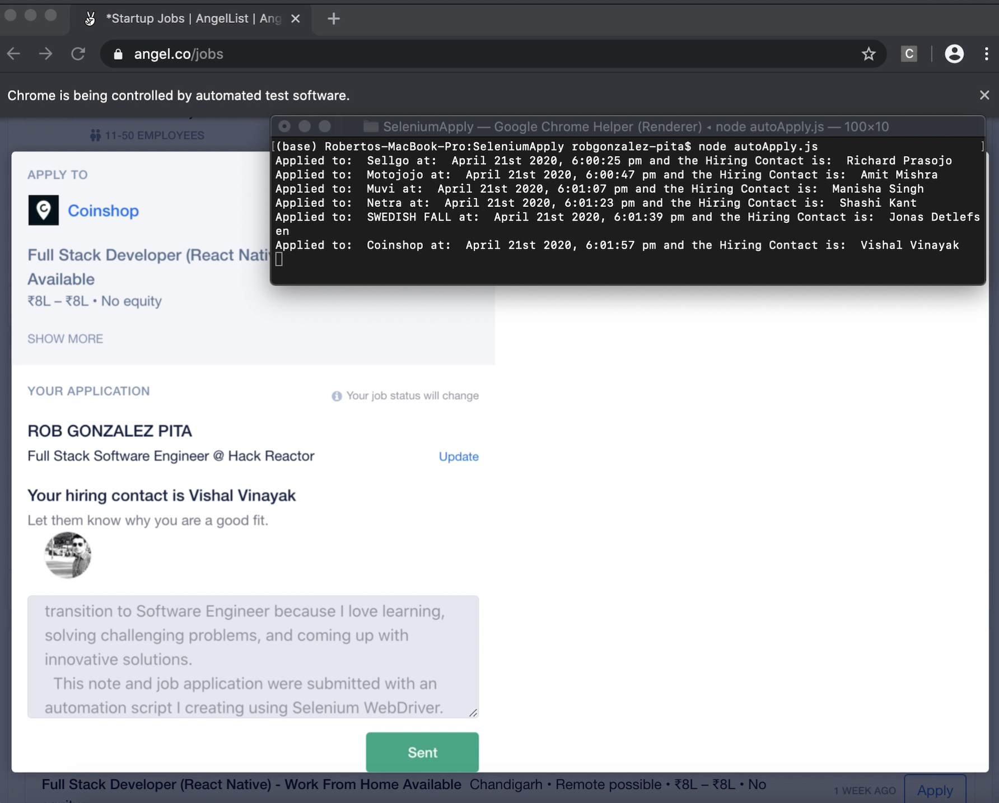

# SeleniumApply

Automate Job Applications for job listings on Angel.co using Selenium WebDriver.

## Description

---

Project Idea is not original. Although a quick google search wasn't too productive on how to automate job applications, a bud of mine created something similar. [Max Caudle](http://maxcaudle.com/contact) (Maison Caiby) mentioned this idea, and here is his [repo](https://github.com/MasonCaiby/auto_app).

But the issues I found with ripping off his code and using it myself are:

1. He wrote his in Python. I have a limited understanding of Python and I like to understand what is going on.

2. I wanted to learn Selenium WebDriver (not its intended use) and writing 'virtual tests' for sites.

3. Angel.co has since changed their website, so his code is outdated.

---

## Examples

[Youtube Video](https://youtu.be/xCWGoQNxbpU) displaying this program sending....

## Installation

Create a profile on [AngelList](https://angel.co/)

Create some basic filters on what types of jobs you're looking for. Ensure those filters are correct, and verify by closing out of that window, log in again, and see if they persist. If the filters persisted, the following program should pick them up when you log in with each new instance of the WebDriver.

Install [Selenium](https://www.npmjs.com/package/selenium-webdriver)

`npm install selenium-webdriver`

Install a [specific webdriver](https://www.selenium.dev/documentation/en/webdriver/driver_requirements/#quick-reference) that you'll be using.

Move the Webdriver to your PATH of choice, i.e.

`sudo mv chromedriver /usr/local/bin/`

Verify your webdriver is indeed in your PATH

`sudo nano /etc/paths`

That should be enough to get you started...

You will have to create a new file in the root directory named usernameAndPw.js where you will create and store variables(usernameAndPw, loginUrl, note) as defined in the autoApply.js file on line 5. The usernameAndPw variable should look like:

`['YourEmailAddress@gmail.com', 'TopsecretPW1234']`

If you so choose to keep track of the jobs you applied to, create a new .csv file and on line 133 of autoApply.js, point the fs.appendFileSync function to the correct path.

---

## Notes

Some of the script navigates filters that are pertinent during the time I'm applying (Covid Days). So these filters might not be pertinent to all job seekers in a given market. The code is heavily commented and explained to give step by step explanations of what each line of code does.

I had some complications with getting the exe file in my PATH env variable, [this Link](https://www.kenst.com/2015/03/including-the-chromedriver-location-in-macos-system-path/) might be useful resource.

## Author

Rob Gonzalez-Pita
